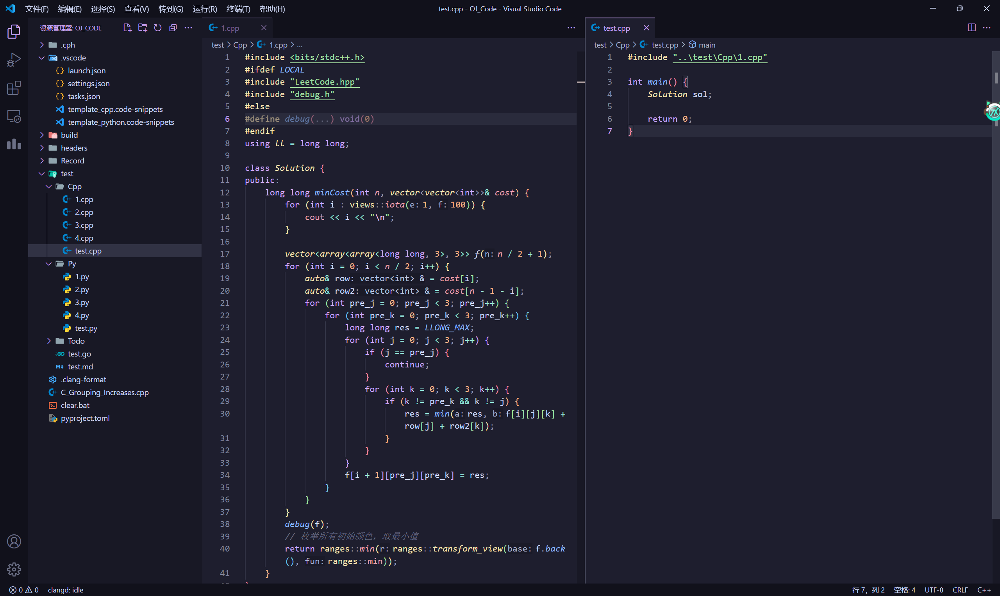

# LeetCode

## 代码框架

可以单独创建 test.cpp 文件用于测试数据，源文件可以直接复制粘贴并提交。配合 cph 插件（debug 信息不影响结果输出）和 LeetCode 竞赛助手（需要修改一下原插件的代码以适合本地代码，可以做成 Tampermonkey 脚本）会很方便。

在 LeetCode.hpp 文件中，加入了 LeetCode 常用的结构体定义，并在最后附上 `using namespace std;` ~~源文件能省一行是一行~~

如果感觉头文件过多，不想在 OJ 上附加太多除了 Class 之外的东西，可以改成下面的代码块并在 LeetCode.hpp 文件中附加 #include "debug.h"，这样本地能用，但提交到 OJ 上需要删掉 debug 信息。
